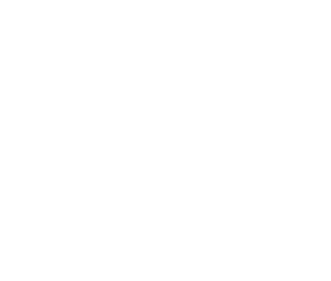

<div align="center">



<br/>

# ROUQY — Where Vision Meets Refinement

**A luxury interior design studio website** crafted with cinematic scroll animations,  
SVG logo draw effects, and a dark immersive aesthetic.

<br/>

🌐 **Live Site:** [www.rouqy.com](https://www.rouqy.com/)

<br/>

[](https://nextjs.org/)
[](https://www.typescriptlang.org/)
[](https://gsap.com/)
[](https://tailwindcss.com/)
[](https://vercel.com/)
[](https://www.rouqy.com/)

<br/>

</div>

---

## ✨ Overview

ROUQY is a single-page portfolio website for a luxury interior design studio based in Riyadh, Saudi Arabia. The site delivers a **cinematic, scroll-driven experience** where every section unfolds through carefully choreographed animations — from an SVG logo that draws itself stroke-by-stroke, to a horizontal gallery that glides as the user scrolls.

The design philosophy is rooted in **restrained elegance**: a deep teal-dark palette (`#0b2b2a`), generous whitespace, ultra-light font weights, and subtle motion. Every interaction feels intentional, every transition feels natural.

> *"Where Vision Meets Refinement."*

---

## 🎬 Key Features

### 🖋️ SVG Logo Draw Animation
The ROUQY logo is rendered as an inline SVG `<path>`. On scroll, GSAP's `strokeDashoffset` technique draws the outline stroke-by-stroke, then fades in the fill — creating an effect as if the logo is being sketched in real time.

### 🎞️ GSAP ScrollTrigger Animations
Every section is powered by GSAP ScrollTrigger with scrub-linked timelines:
- **Intro** — Logo fades in with scale animation, then dissolves to reveal the hero
- **About** — Logo draws → fills → scales 7x → slides right → content reveals from left (desktop) / vertical cascade (mobile)
- **Projects** — Horizontal scroll gallery pinned to viewport, driven by vertical scroll
- **Contact** — Staggered fade-up reveal for form and details

### 🖼️ Portfolio Gallery System
- **Horizontal scroll showcase** — 6 featured projects in a pinned scroll-jacked gallery
- **Full gallery overlay** — Click any image or the CTA card to open a grid overlay with all 16 projects
- **Image lightbox** — Full-screen lightbox with prev/next navigation and counter

### 💬 WhatsApp Floating Button
A fixed-position WhatsApp CTA in the bottom-left with:
- Rotating circular text (`<textPath>` on SVG circle) — *"GET IN TOUCH"*
- Soft pulse ring animation
- Company logo icon (not the default WhatsApp icon)
- Direct link to WhatsApp chat

### 📱 Fully Responsive
Four breakpoints for a seamless experience across devices:
| Breakpoint | Target |
|---|---|
| `> 1024px` | Desktop |
| `≤ 1024px` | Tablet |
| `≤ 768px` | Mobile |
| `≤ 420px` | Small mobile |

Mobile adaptations include: adjusted About animation (logo scales up then repositions vertically), smaller gallery images, stacked contact layout, and compact WhatsApp button.

### 📝 JSON-Driven Content
All editable content lives in a single file — `src/data/site-data.json`. The client can update:
- Brand name and tagline
- Side text (hero vertical text)
- About section heading and description
- Project images and titles
- Contact info (email, phone, studio, socials)
- WhatsApp number and rotating text
- Navigation links

No code changes required. Edit the JSON → deploy → done.

### 📬 Contact Form with Validation
Server-side API route (`/api/contact`) with:
- Required field validation
- Email format verification
- Error/success states with inline messages
- Form reset on success

### 🔍 SEO & Social
- Full Open Graph and Twitter Card meta tags
- Semantic HTML with proper heading hierarchy
- Custom favicon and Apple Touch Icon
- Theme color matching the brand palette
- Canonical URL and robots configuration

---

## 🛠️ Tech Stack

| Technology | Purpose |
|---|---|
| **Next.js 16** (App Router) | React framework with server components, API routes, and standalone output |
| **TypeScript** | Type safety across all components and data structures |
| **GSAP 3.15** + ScrollTrigger + ScrollToPlugin | High-performance scroll-driven and timeline animations |
| **Tailwind CSS 4** | Utility-first CSS with custom theme tokens |
| **Outfit** (Google Fonts) | Variable weight font (200–700) for the luxury typographic feel |
| **Vercel** | Deployment platform with edge-optimized builds |

---

## 📁 Project Structure

```
src/
├── app/
│   ├── api/
│   │   └── contact/
│   │       └── route.ts          # Contact form API endpoint
│   ├── globals.css               # All custom styles (~1200 lines)
│   ├── layout.tsx                # Root layout with fonts, metadata, SEO
│   └── page.tsx                  # Main single-page component
├── data/
│   └── site-data.json            # 📝 Client-editable content config
public/
├── logo.svg                      # ROUQY icon logo (header, WhatsApp, favicon)
├── logo.png                      # OG image
├── text.svg                      # ROUQY full text logo (hero)
├── favicon.ico                   # Browser tab icon
├── apple-touch-icon.png          # iOS home screen icon
└── project1.jpg … project16.jpg  # Portfolio images
```

---

## 🚀 Getting Started

### Prerequisites
- Node.js 18+ or Bun
- npm, yarn, or bun

### Installation

```bash
# Clone the repository
git clone https://github.com/your-username/rouqy.git
# Live site: https://www.rouqy.com/
cd rouqy

# Install dependencies
npm install

# Start development server
npm run dev
```

The site will be available at `http://localhost:3000`.

### Build for Production

```bash
npm run build
npm run start
```

The build uses Next.js `output: "standalone"` for optimized containerized deployment.

---

## ⚙️ Configuration

### Editing Site Content

All user-facing content is managed through **`src/data/site-data.json`**:

```jsonc
{
  "brand": {
    "name": "ROUQY",           // Company name
    "since": "SINCE 2022"      // Year established
  },
  "sideText": {
    "left": "SINCE 2022",      // Hero left vertical text
    "right": [                   // Hero right vertical text items
      "INTERIOR DESIGN",
      "3D VISUALIZATION",
      "PROJECT EXECUTION",
      "SITE SUPERVISION"
    ]
  },
  "about": { /* About section content */ },
  "projects": {
    "scrollCount": 6,           // Number of projects in horizontal scroll
    "items": [
      { "image": "/project1.jpg", "title": "Modern Living" },
      // Add/remove items as needed
    ]
  },
  "contact": { /* Contact details */ },
  "whatsapp": {
    "phone": "966570533358",    // WhatsApp number (without +)
    "rotatingText": "GET IN TOUCH • GET IN TOUCH •"
  },
  "nav": { /* Navigation links */ }
}
```

### Adding/Removing Portfolio Images
1. Place new images in `public/` as `projectN.jpg`
2. Add corresponding entries in `site-data.json` → `projects.items`
3. Adjust `scrollCount` to control how many appear in the horizontal scroll
4. Redeploy

---

## 🎨 Design System

### Color Palette

| Token | Value | Usage |
|---|---|---|
| Background | `#0b2b2a` | Primary background |
| Accent | `#1a857a` | WhatsApp button, interactive highlights |
| Success | `#2a9d6e` | Form success state |
| Error | `#e74c3c` | Form error state |
| Header Gradient | `rgba(29, 55, 45, 0.75)` → transparent | Scroll header backdrop |
| Text Primary | `#fff` | Headings, body |
| Text Secondary | `rgba(255, 255, 255, 0.65)` | Descriptions |
| Text Muted | `rgba(255, 255, 255, 0.4)` | Labels, captions |
| Divider | `rgba(255, 255, 255, 0.25)` | Lines, borders |

### Typography

| Weight | Value | Usage |
|---|---|---|
| Ultra Light | 200 | Subheadings, accent text (`light`) |
| Light | 300 | Body text, descriptions |
| Regular | 400 | Navigation, form labels |
| Medium | 500 | — |
| Bold | 700 | Headings, emphasis (`bold`) |

Font: **Outfit** (variable, Google Fonts) with `clamp()` responsive sizing.

---

## 🎭 Animation Breakdown

| Section | Animation | GSAP Technique |
|---|---|---|
| **Intro** | Logo scale-in → fade out | CSS animation + React state |
| **Hero** | Logo reveal (translateY + opacity) | CSS keyframe on `.show` |
| **Hero** | Scroll indicator line | CSS `::after` animation |
| **About (Desktop)** | Stroke draw → fill → scale 7x → translate right → content slide-in | ScrollTrigger scrub timeline (5 steps) |
| **About (Mobile)** | Stroke draw → fill → scale up → reposition up → content fade-up | ScrollTrigger scrub timeline (5 steps) |
| **Projects** | Horizontal gallery scroll | ScrollTrigger `pin` + `scrub` |
| **Contact** | Staggered fade-up of children | ScrollTrigger + `stagger: 0.15` |
| **Navigation** | Smooth scroll to section | GSAP ScrollToPlugin with dynamic duration |
| **Header** | Glassmorphism on scroll | CSS `backdrop-filter` + React state |
| **WhatsApp** | Pulse ring + rotating text | CSS `@keyframes` (infinite loops) |
| **Gallery Images** | Hover scale + overlay + title reveal | CSS transitions |
| **Lightbox** | Fade-in overlay | CSS animation |

---

## 🌐 Deployment

### Vercel (Recommended)

1. Push the repository to GitHub
2. Import the project on [vercel.com](https://vercel.com)
3. Vercel auto-detects Next.js — no configuration needed
4. Set up custom domain in **Settings → Domains**
5. Update DNS records at your domain registrar as instructed

Every push to `main` triggers an automatic deployment.

---

## 📸 Screenshots

> *Note: Replace with actual screenshots after deployment*

| Section | Preview |
|---|---|
| Hero | Full-viewport dark background with centered ROUQY text logo, vertical side text, and scroll indicator |
| About | Logo draws itself on scroll, scales across the viewport, content fades in |
| Projects | Pinned horizontal scroll gallery with 6 featured images and CTA card |
| Gallery | Full-screen overlay grid with 16 project thumbnails |
| Lightbox | Full-screen image viewer with prev/next navigation |
| Contact | Split layout — form on left, details on right |
| WhatsApp | Floating teal button with rotating text and pulse animation |

---

## 📄 License

This project is a custom-built website for **ROUQY Interior Design Studio**.  
All rights reserved. The code, design, and assets are proprietary.

---

<div align="center">

**Built with precision and care.**

</div>
